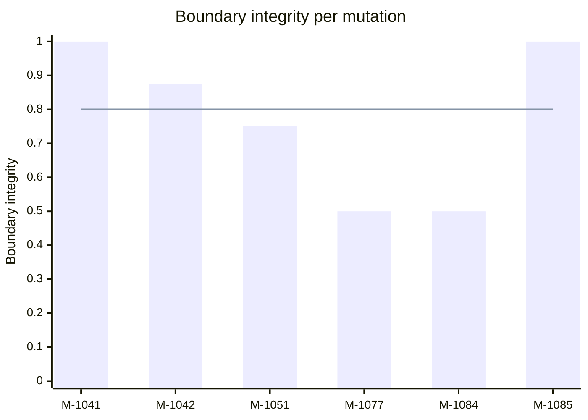
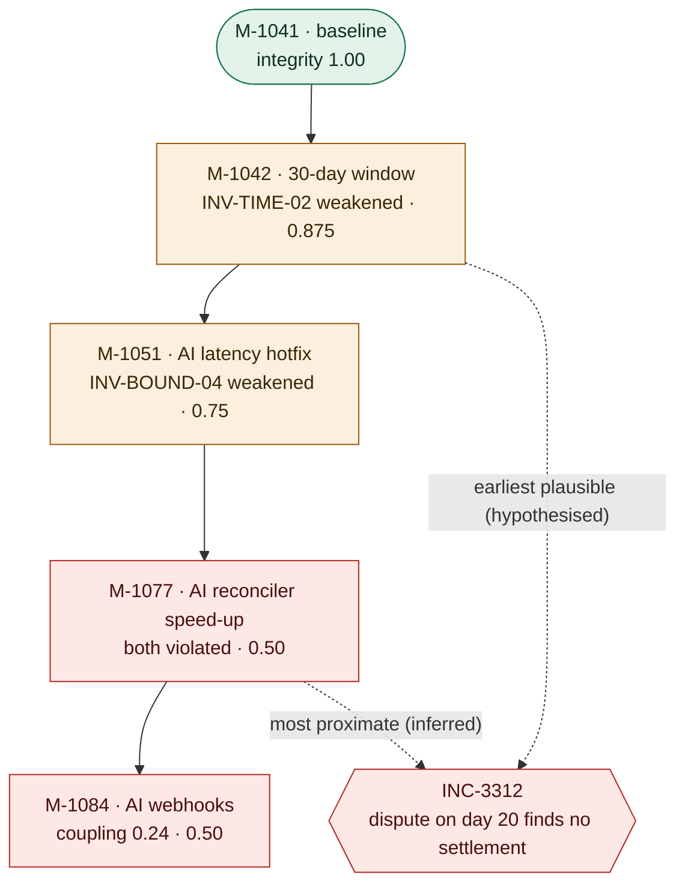
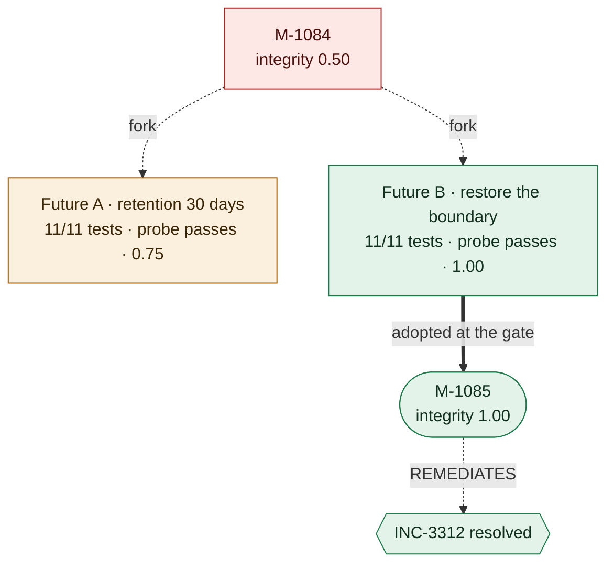
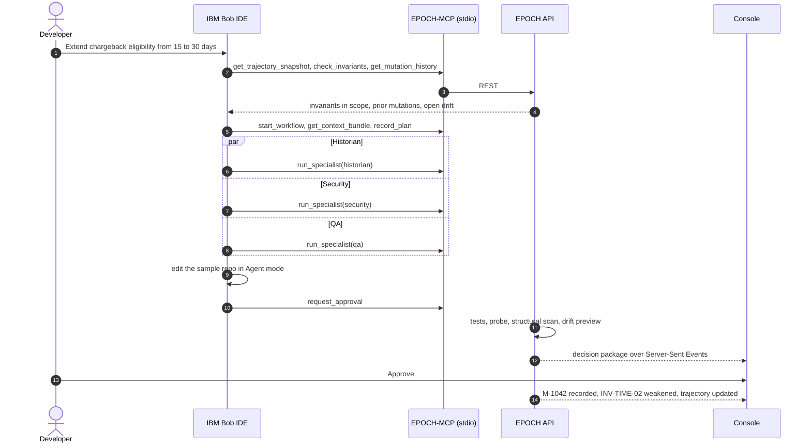
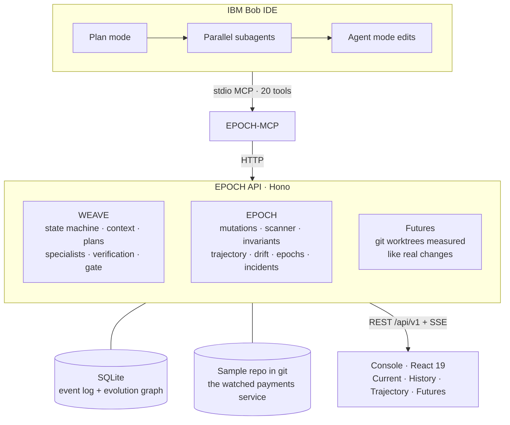
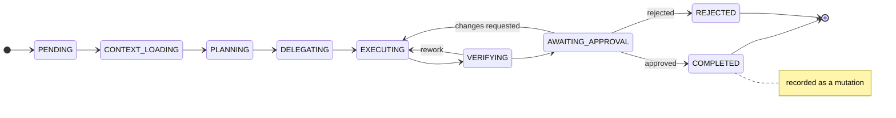

<p align="center">
  
</p>

<p align="center">
  <a href="https://github.com/vighriday/epoch-software-evolution/actions/workflows/ci.yml"></a>
  
  
  
  
  <a href="LICENSE"></a>
</p>

<p align="center">
  <a href="#see-it-run">See it run</a> ·
  <a href="#the-story-in-numbers">The story in numbers</a> ·
  <a href="#how-ibm-bob-drives-epoch">IBM Bob</a> ·
  <a href="#architecture">Architecture</a> ·
  <a href="#documentation">Docs</a>
</p>

<p align="center">
  <a href="https://codespaces.new/vighriday/epoch-software-evolution?quickstart=1"></a>
</p>

---

Coding agents are good at individual tasks. What they lose is the system: dozens of changes that each pass their own tests can still erode a boundary, break a business rule, or set up an incident nobody traces back. **EPOCH treats the trajectory of a system, not the individual change, as the thing to engineer.** IBM Bob does the work; EPOCH remembers what the system has become and puts a person at the gate.

> [!IMPORTANT]
> **A change can be correct. A system can still be getting worse.** EPOCH records every approved change as a *mutation*, measures the system after it, and reasons over the sequence.

## Why

Frontier coding agents do far worse on long-horizon evolution than on isolated tasks ([sources](docs/RESEARCH_NOTES.md)):

| Benchmark | Isolated tasks | Long-horizon evolution |
| --- | --- | --- |
| SWE-EVO (v1, 2025), GPT-5 with OpenHands | 65% (SWE-Bench Verified) | 21% |
| EvoClaw, now SWE-Milestone (2026), overall scores | above 80% | at most 38% |
| RoadmapBench (2026), strongest model | | 39.1% (Claude Opus 4.7) |

The missing piece is not code generation. It is memory of what the system has become, and a way to steer it.

## What it is

| Plane | Question it answers | What it does |
| --- | --- | --- |
| **WEAVE** | What are we doing now? | Runs each change as a governed workflow: requirement → context bundle → plan → specialists in parallel → verification → human approval |
| **EPOCH** | What has the system become? | Records mutations, scans the code after each one, tracks invariants, trajectory, drift, epochs and incidents, and traces candidate causal chains |
| **Futures** | What could it become? | Forks the system into git worktrees, measures alternative fixes like real changes, and adopts one through the same gate |
| **IBM Bob** | How is the work done? | Plans, implements and runs specialists from subagents, all through the 20-tool EPOCH-MCP server |

## See it run

Requirements: Node.js 22+, pnpm 9+, Git. No database server, Docker or credentials.

```bash
pnpm install
pnpm demo-reset                    # fresh database and sample repo: epoch E-0, 22 mutations
pnpm dev                           # API on http://127.0.0.1:3000, console on http://127.0.0.1:5173
```

Then, from IBM Bob (see below) or a second terminal:

```bash
pnpm demo:replay --with-feature    # M-1042, then three AI changes: drift, INC-3312, epoch E-1
pnpm demo:futures                  # fork and measure futures A and B from the latest mutation
```

Adopt a future with `POST /api/v1/simulations/remediate`, run it to the gate, approve it, and M-1085 brings the trajectory back. The full walkthrough is in [docs/DEMO_GUIDE.md](docs/DEMO_GUIDE.md).

> [!NOTE]
> The console's four views are being switched from their design data to the live `/api/v1` feed. Until that lands, follow the story through Bob, the API and the event stream at `/api/stream`.

<details>
<summary><b>More ways to run it</b></summary>

| Where | How |
| --- | --- |
| GitHub Codespaces | Use the button above. The container installs, seeds the demo and forwards the console (5173) and the API (3000); run `pnpm dev`. |
| One container | `docker build -t epoch . && docker run --rm -p 8080:8080 epoch`, then open <http://localhost:8080>. The API serves the console on the same port in a guarded public mode. |
| Your own hosted copy | [](https://render.com/deploy?repo=https://github.com/vighriday/epoch-software-evolution) builds the same image from [`render.yaml`](render.yaml) on your Render account; every push to the repository redeploys it. |

The container opens on the moment a reviewer chooses a future. Visitors can adopt one, run it to the gate and approve it; every other write answers 403, and a changed demo restores itself after 20 idle minutes ([ADR-029](DECISIONS.md#adr-029-a-hosted-demo-runs-in-a-guarded-public-mode)). CI builds the image, boots it and finishes the story as a visitor on every push.

</details>

<details>
<summary><b>All commands</b></summary>

| Command | What it does |
| --- | --- |
| `pnpm dev` | API and console together |
| `pnpm demo-reset` | Rebuild the database and sample repo; deterministic |
| `pnpm demo:replay [--with-feature]` | Record the safe-looking AI changes (and the scripted M-1042) |
| `pnpm demo:futures` | Fork and measure futures A and B |
| `pnpm test` | Unit, integration and end-to-end tests |
| `pnpm typecheck` | Strict TypeScript for the platform, the console and the sample app |
| `pnpm build` · `pnpm start` | Build the console · run the API without watch mode |
| `pnpm mcp` | EPOCH-MCP on stdio (Bob starts it from `.bob/mcp.json`) |
| `pnpm showcase:snapshot` | Save the public demo's showcase for fast restores |

</details>

## The story in numbers

The repository ships a small payments service ([`packages/sample-app`](packages/sample-app)) with a seeded history. Every number below comes from EPOCH's scanner, the service's 11 tests or its runtime probe. Nothing is typed in by hand; `pnpm test` checks this story end to end. The line marks the envelope floor at 0.80.



| Mutation | Change | Tests | Integrity | Coupling | What EPOCH records |
| --- | --- | --- | --- | --- | --- |
| M-1041 | End of the seeded baseline, epoch E-0 | 11/11 | 1.00 | 0.19 | Four invariants holding |
| **M-1042** | Chargeback window 15 → 30 days (implemented by Bob in the live demo) | 11/11 | 0.875 | 0.19 | `INV-TIME-02` weakened: ledger retention is still 15 days. DRIFT-401 |
| M-1051 | AI latency hotfix: disputes read order status straight from the order store | 11/11 | 0.75 | 0.21 | `INV-BOUND-04` weakened. DRIFT-402, boundary erosion |
| M-1077 | AI speed-up: the reconciler reads settled amounts from the ledger table | 11/11 | 0.50 | 0.21 | Both invariants violated, the probe fails: **INC-3312**; epoch E-1 proposed |
| M-1084 | AI change: merchant webhook on every reconciliation | 11/11 | 0.50 | 0.24 | DRIFT-403, dependency growth |
| **M-1085** | Adopted future B: back through the order and ledger services, retention covers disputes | 11/11 | 1.00 | 0.24 | INC-3312 and DRIFT-401/402 resolved; epoch E-2 proposed |

Every change passed every test. Only the trajectory shows the damage.

Causal archaeology ranks the candidate chain behind INC-3312, drawn here from cause to incident:



Two futures are forked from M-1084 into git worktrees and measured like real changes. The reviewer adopts one through the same gate:



Both futures pass all 11 tests and the probe. They differ in what they leave behind:

| Future | Change | Tests | Probe | Integrity | Coupling | Outcome |
| --- | --- | --- | --- | --- | --- | --- |
| A · Keep the current path | Ledger retention 15 → 30 days | 11/11 | passes | 0.75 | 0.24 | The boundary stays violated |
| B · Restore the boundary | Reconciler and dispute API go through the services again; retention covers the dispute window | 11/11 | passes | 1.00 | 0.24 | Recommended and adopted as M-1085 |

DRIFT-403 stays open after M-1085 as a warning. Neither future removed the new webhook dependency, and EPOCH says so.

## How IBM Bob drives EPOCH

EPOCH does not call Bob. Bob calls EPOCH. The lifecycle is driven from Bob IDE through **EPOCH-MCP**, a stdio MCP server registered in [`.bob/mcp.json`](.bob/mcp.json), so Bob reads the system's history before it changes anything and every step it takes lands on the record.



There is deliberately no approve tool: a person decides at the gate. Read tools are auto-allowed in Bob; write tools ask first. Exported Bob task sessions are kept in [`bob_sessions/`](bob_sessions/) and indexed in [docs/BOB_SESSIONS.md](docs/BOB_SESSIONS.md).

<details>
<summary><b>All 20 EPOCH-MCP tools</b></summary>

| Tool | Access | Purpose |
| --- | --- | --- |
| `get_trajectory_snapshot` | read | Current integrity, coupling, envelope and open findings |
| `get_mutation_history` | read | Recent mutations, optionally for one component |
| `get_mutation` | read | One mutation with its evidence and trajectory delta |
| `check_invariants` | read | Invariant status, optionally for given components |
| `get_causal_chain` | read | Candidate chain for an incident, finding, invariant, mutation or symptom |
| `list_drift_findings` | read | Open or resolved drift findings |
| `list_active_workflows` | read | Workflows in progress |
| `get_workflow_status` | read | State, tasks, evidence and decision of one workflow |
| `get_context_bundle` | read | Requirement, relevant files, prior mutations, invariants, provenance |
| `get_decision_package` | read | What the reviewer sees at the gate |
| `get_repo_status` | read | Path, HEAD and changed files of the watched repo |
| `get_simulation` | read | Futures with their measurements and the recommendation |
| `start_workflow` | write | Open a WEAVE workflow for a requirement |
| `record_plan` | write | Record the plan and create the specialist task graph |
| `run_specialist` | write | Run context, historian, security, QA, evolution, incident or synthesis |
| `record_evidence` | write | Add a labelled claim (observed, inferred, hypothesised) |
| `request_approval` | write | Verify the working tree and move to the approval gate |
| `start_incident_workflow` | write | Investigate an incident with its causal chain in context |
| `fork_futures` | write | Create up to three worktrees at a mutation |
| `evaluate_future` | write | Run tests, probes and the scan inside one future |

</details>

## Architecture



- **Measured, not asserted.** A deterministic scanner reads the watched repository's imports and policy constants and evaluates the machine-checkable rules in [`invariants.json`](packages/sample-app/invariants.json). Tests and the runtime probe run in child processes. Only those results become `observed` evidence.
- **Governed changes.** Workflows follow a strict state machine with a persisted transition log. Nothing reaches the evolution graph without a recorded human or policy decision.
- **Isolation.** The sample service is copied into its own git repository under `.epoch/`, and futures are worktrees of it. Git runs without a shell, with validated identifiers.
- **Deterministic.** `pnpm demo-reset` produces the same mutations, timestamps and state hashes on every run, and a test checks it.



Every WEAVE workflow follows this state machine; any open state can also move to `REJECTED`. Details are in [ARCHITECTURE.md](ARCHITECTURE.md) and the decision records in [DECISIONS.md](DECISIONS.md).

<details>
<summary><b>What EPOCH watches in the sample service</b></summary>

| Invariant | Rule |
| --- | --- |
| `INV-BOUND-04` | The order store and the ledger table are imported only from inside their own module |
| `INV-TIME-02` | The chargeback window never exceeds ledger retention |
| `INV-DATA-01` | The double-entry ledger balances |
| `INV-SEC-09` | Card numbers are reachable only through the card vault |

The runtime probe settles an order on day 0, archives on day 16 and disputes on day 20. It fails when a dispute is accepted but its settlement can no longer be found, and that failure is INC-3312.

</details>

<details>
<summary><b>Repository layout</b></summary>

```text
src/
  api/          Hono server, REST routes, /api/v1 console adapter, SSE, EPOCH-MCP server, public demo guard
  core/weave/   workflow state machine, context builder, task graph, agent runner, verification, approval gate
  core/epoch/   mutation engine, invariants, trajectory, epochs, incidents, evolution debt
  core/futures/ counterfactual futures
  agents/       context, historian, security, QA, evolution analyst, incident, synthesis
  graph/        scanner, drift patterns, causal archaeology, graph export, trajectory analytics
  sandbox/      git without a shell, sample repo, worktrees, test and probe runners
  store/        SQLite schema and typed queries
  console/      the four-view console (React 19, Vite, Tailwind CSS 4)
packages/sample-app/   the watched payments service, its invariants, history and replayable changes
scripts/        demo-reset, seed, demo:replay, demo:futures, showcase:snapshot, epoch-mcp launcher
tests/          unit, integration and end-to-end tests
.bob/           IBM Bob configuration
```

</details>

## Evidence discipline

| Label | Means | Produced by |
| --- | --- | --- |
| `observed` | Measured: a scan, a test run, a probe, a record | Scanner, runners, specialists |
| `inferred` | Concluded from observations | Specialists, the causal archaeologist |
| `hypothesised` | A candidate explanation worth checking | The causal archaeologist, Bob |

Causal chains are ranked candidates, never proof ([ADR-018](DECISIONS.md#adr-018-causal-archaeology-uses-graph-bfs-not-llm-assertion)). A claim is never upgraded, and an unknown security result is never reported as safe.

## Documentation

| Document | Contents |
| --- | --- |
| [docs/DEMO_GUIDE.md](docs/DEMO_GUIDE.md) | Run the demo yourself, step by step |
| [docs/API_CONTRACT.md](docs/API_CONTRACT.md) | REST, `/api/v1`, SSE events, EPOCH-MCP tools, public demo mode, configuration |
| [ARCHITECTURE.md](ARCHITECTURE.md) | Layers, data flow, persistence, the scanner, futures, Bob integration |
| [DECISIONS.md](DECISIONS.md) | 29 architecture decision records |
| [docs/DATA_MODEL.md](docs/DATA_MODEL.md) | Entities, tables and graph edges |
| [docs/AGENTS.md](docs/AGENTS.md) | Specialist agents, their contracts and guardrails |
| [docs/TECHSTACK.md](docs/TECHSTACK.md) | Technologies and why |
| [docs/RESEARCH_NOTES.md](docs/RESEARCH_NOTES.md) | Sources behind the problem statement, checked against each paper |
| [docs/BOB_SESSIONS.md](docs/BOB_SESSIONS.md) | Index of exported IBM Bob sessions |

## Limits

EPOCH is a hackathon prototype built around one watched service. The scanner understands TypeScript imports and numeric policy constants, not arbitrary semantics. Causal chains are ranked hypotheses. Futures are measured scenarios, not production predictions. The evolution debt scores are interpretations and are labelled as such.

## Team and licence

Built for the IBM Bob 2.0 hackathon on lablab.ai by Hriday and Sarthak Sulkhlan. MIT licensed, see [LICENSE](LICENSE).
